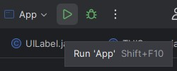
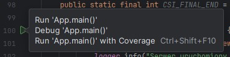
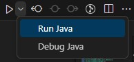
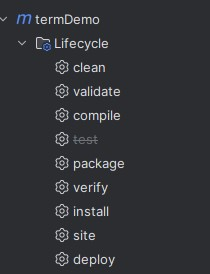
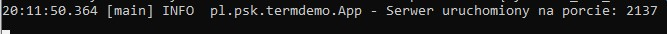
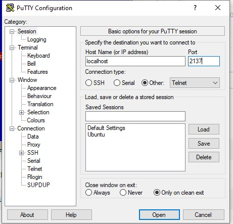
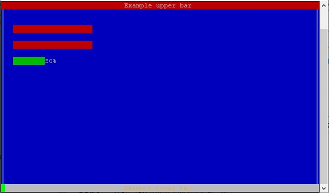
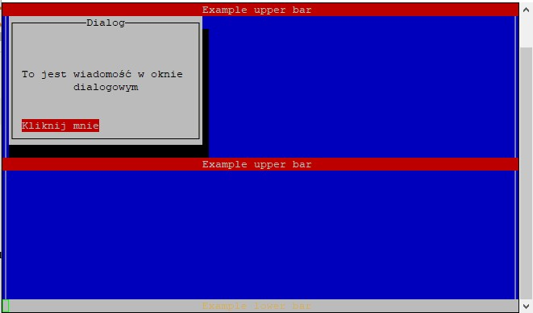
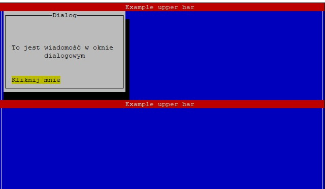

## Uruchomienie projektu

- IntelliJ Idea:
    - Nacisnąć przycisk &#9654;&#65039; w oknie programu z wybraną konfiguracją 
    
    - W przypadku błędnej konfiguracji zmienić wersję SDK na działającą w systemie (lub ją doinstalować)
    - Ewentualnie uruchomić metodę `main` z klasy `App` 
    
- VS Code:
    - Otworzyć główny katalog w VS Code, a następnie przejść do pliku [App.java](src/main/java/pl/psk/termdemo/App.java) i wybrać opcję `Run Java` 

## Plik jar
Aby utworzyć wykonywalny plik jar należy wybrać opcję `package` z menu `Lifecycle`

W katalogu `target` pojawią dwa pliki:
- term-emu-0.1-SNAPSHOT.jar
- term-emu-0.1-SNAPSHOT-jar-with-dependencies.jar

Aby uruchomić serwer należy w wierszu poleceń wpisać: 
`java -jar term-emu-0.1-SNAPSHOT-jar-with-dependencies.jar`

## Połączenie z serwerem
Do połączenia z serwerem można wykorzystać dowolny program obsługujący połączenie za pomocą protokołu Telnet (SSH obecnie nie jest dostępne) np. [PuTTY](https://www.putty.org/)

Parametry do połączenia z serwerem na przykładzie programu PuTTY:

Po połączeniu z serwerem wyświetlona zostanie wiadomość powitalna

Po 3 sekundach konsola zmieni swój wygląd i wyświetlone zostanie okno dialogowe.

Kombinacja klawiszy `CTRL + I` pozwala na wybór przycisku w menu dialogowym.

W tej wersji okno dialogowe jest martwe. 
Aby rozłączyć się z serwerem trzeba zamknąć okno programu, który jest podłączony do serwera (`CTRL + C` nic nie da) 
<i>That's all folks!</i>