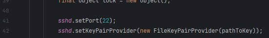

# Uruchomienie aplikacji w wersji SSH

1. Należy przejść do klasy `pl.psk.termdemo.ssh.SSHServer`, która dostępna jest [tutaj](src/main/java/pl/psk/termdemo/ssh/SSHServer.java).
2. Należy uruchomić metodę `main`.
3. W przypadku problemów z uprawnieniami z dostępem do portu należy zmienić numer portu w metodzie `setPort` 

# Połączenie z serwerem przez SSH

<h1 style="color:red"><strong>Nie łączyć się przez PuTTY !!!</strong></h1>

Windows 
- w wierszu poleceń wpisać polecenie `ssh -l admin localhost` 

- Wprowadzić hasło (domyślne to <i>`admin`</i>)
- Po zalogowaniu widoczna będzie główna część aplikacji 

W razie braku dostępu do polecenia SSH należy dodać funkcję klienta OpenSSH w funkcjach opcjonalnych. 

Linux 
- otworzyć terminal
- wpisać polecenie `ssh -l admin localhost`
- w przypadku użycia portu innego niż domyślny można podać polecenie `ssh -l admin localhost -p `<i>`<port>`</i>
- zalogować się do serwera analogicznie jak w przypadku systemu Windows